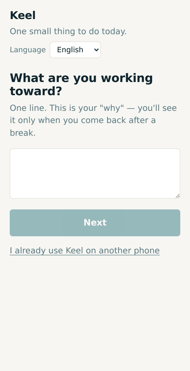
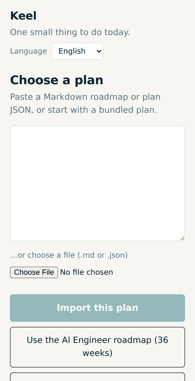
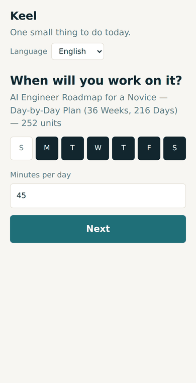
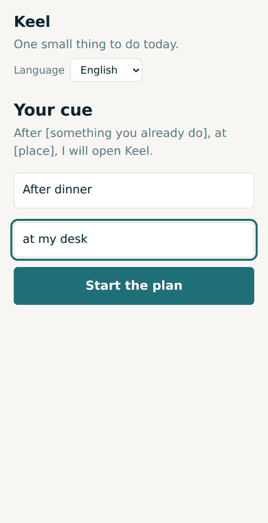
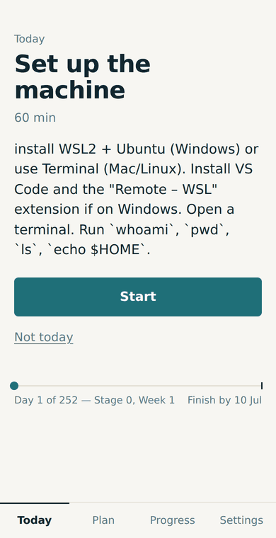
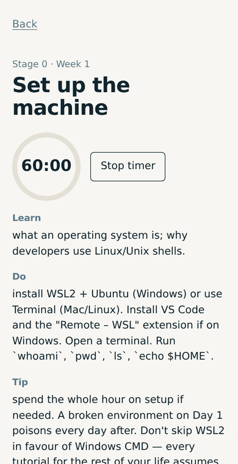
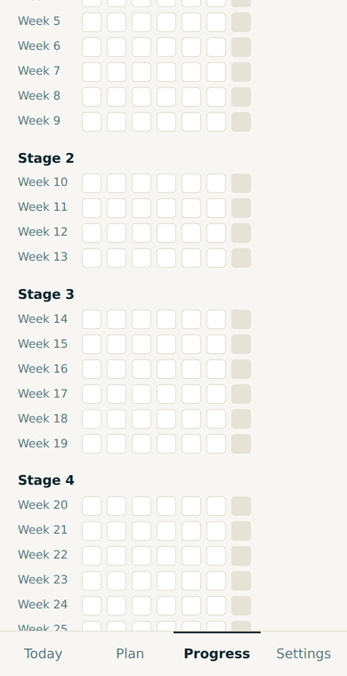
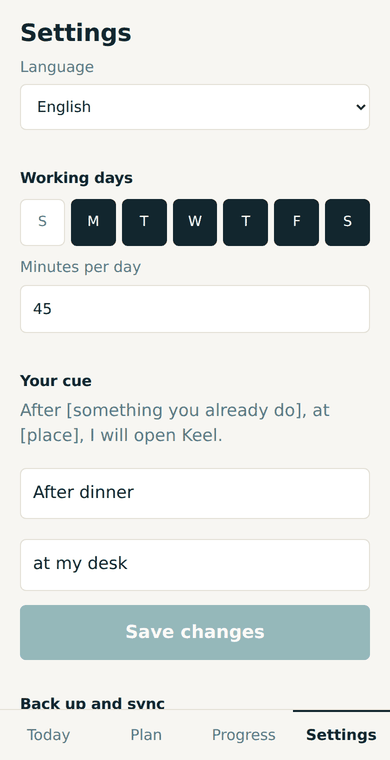
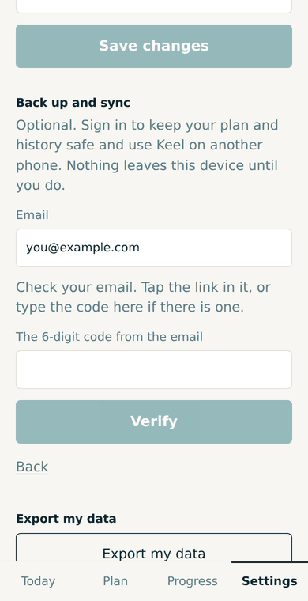
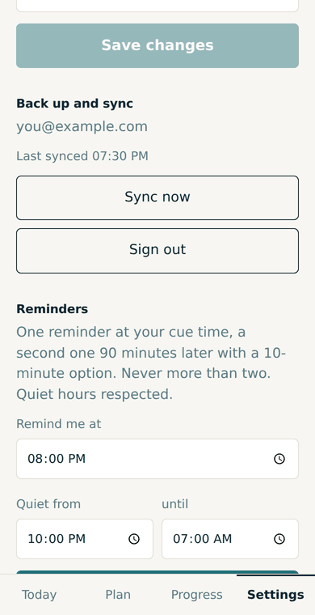

# Keel on your phone

Keel is a web app that installs like a normal app. No app store, no account needed to start. Free.

**Link:** https://keel-hshahfahad58-2498s-projects.vercel.app/

## 1. Install to your Home screen (1 minute)

**Android (Chrome):** open the link → tap the **⋮ menu** (top right) → **Add to Home screen** (or **Install app**) → **Add**. Open Keel from the icon, not from the browser.

**iPhone (Safari):** open the link in **Safari** (not Chrome) → tap **Share** (the square with the arrow) → **Add to Home Screen** → **Add**. Reminders on iPhone only work from the Home-screen icon (iOS 16.4+).

## 2. Set up (2 minutes)

| Step | What you'll see |
|---|---|
| Write your "why" in one line. You only see it again when you come back after a break. |  |
| Choose a plan. Tap **Use the AI Engineer roadmap (36 weeks)**, or paste your own Markdown / choose a file. |  |
| Pick the days you'll work. The roadmap is built for 6 days a week; fewer days just makes it longer. |  |
| Your cue: after what, and where. This is when Keel will remind you. |  |

## 3. Every day

| | |
|---|---|
| **Today** shows one unit: title, minutes, what to do. Tap **Start**. Can't today? **Not today** → push to tomorrow, or do a 10-minute review instead. Both are fine. |  |
| The unit screen has a timer, the learn / do / tip text, and three lines for what you did. Tap **Done**. |  |
| **Progress** shows the course line, the consistency score (last 28 days — a missed day never resets it), and the weekly review. |  |

Miss a day: the plan shifts. Miss three: a 10-minute re-entry. Miss a week: an offer to halve the next two weeks. Nothing is ever "overdue".

## 4. Optional: back up, sync and reminders

| | |
|---|---|
| Settings → **Back up and sync** → your email → **Send me a code**. |  |
| Open the email and **tap the link** (or type the code if there is one). You're signed in; your plan is now backed up and works on a second phone. |  |
| Settings → **Reminders** → set the time (your cue time) and quiet hours → **Turn reminders on** → allow notifications. One reminder at that time, a second 90 minutes later with a 10-minute option, never more than two a day. |  |

## If something is off

- **The icon opens the browser, not the app:** you added a bookmark. Redo step 1 from Chrome's ⋮ menu (Android) or Safari's Share sheet (iPhone).
- **No reminder arrived:** check that Keel was allowed notifications (phone Settings → Apps → Chrome / Keel → Notifications), that the time is outside quiet hours, and that you had a unit due today (rest days send nothing).
- **The sign-in link opened a wrong page:** tell Saito; that is a server setting, not your phone.
- **Delete everything:** Settings → *Delete plan and history* (this phone) or *Delete my account* (server too).

Questions and complaints go to Saito directly. One line is enough.
